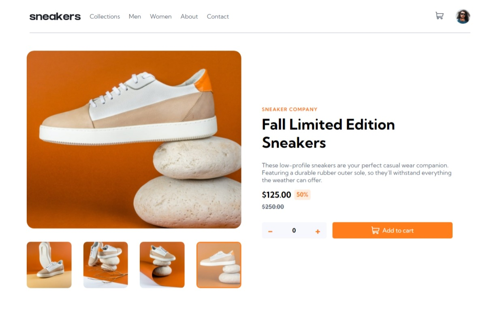

# Frontend Mentor - E-commerce product page solution

This is a solution to the [E-commerce product page challenge on Frontend Mentor](https://www.frontendmentor.io/challenges/ecommerce-product-page-UPsZ9MJp6). Frontend Mentor challenges help you improve your coding skills by building realistic projects.

## The challenge

Users should be able to:

- View the optimal layout for the site depending on their device's screen size
- See hover states for all interactive elements on the page
- Open a lightbox gallery by clicking on the large product image
- Switch the large product image by clicking on the small thumbnail images
- Add items to the cart
- View the cart and remove items from it

## Screenshot

#

## Links

- Solution URL: [GitHub](https://github.com/JustShuaib/product-page)
- Live Site URL: [Live site](https://sneaker-ecommerce-product-page.netlify.app/)

## Built with

- [React](https://reactjs.org/) - JS library
- [Styled Components](https://styled-components.com/) - For styles

## Continued development

This is my first project using `styled components`. I enjoyed using it, and I'd definitely explore it more on future projects.

## Useful resources

- [Styled components official docs](https://styled-components.com/docs) - This got me up and running with what I needed to know about styled components.

## Author

- Github - [Adeoti Shuaib](https://www.github.com/JustShuaib)
- Frontend Mentor - [@justshuaib](https://www.frontendmentor.io/profile/justshuaib)
- Twitter - [@JustShuaib](https://www.twitter.com/JustShuaib)
